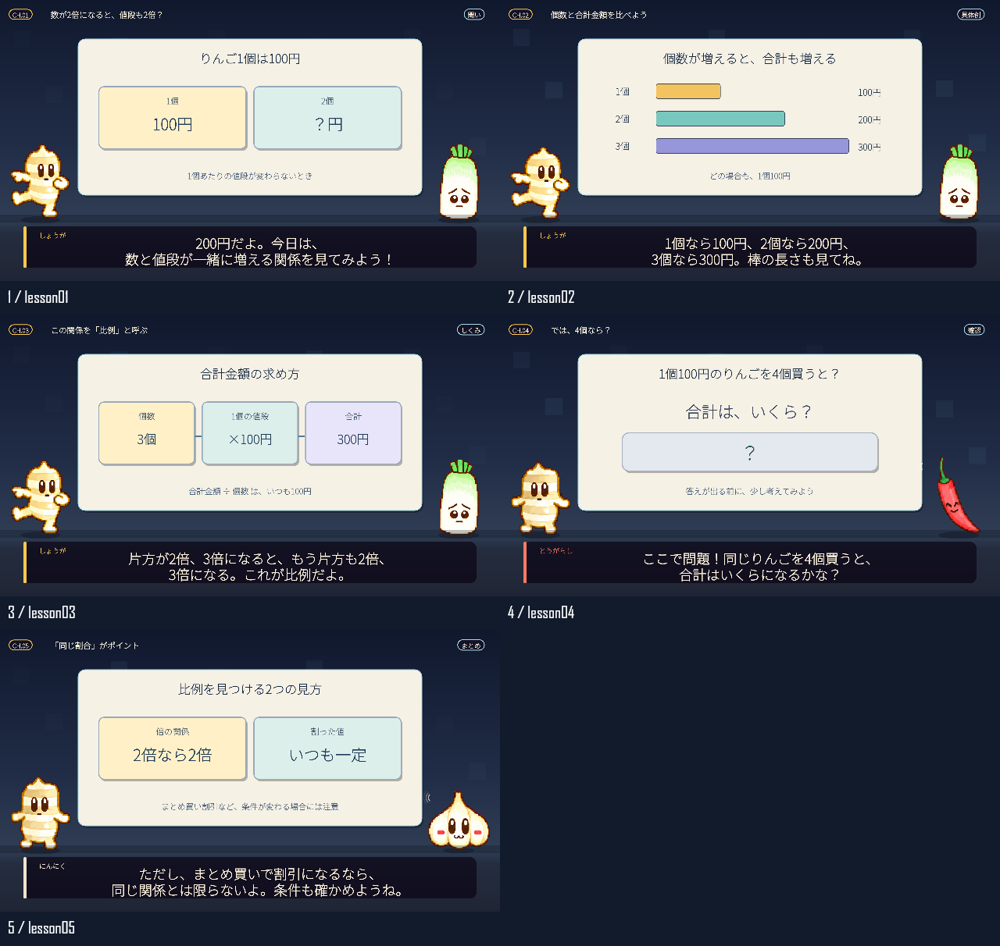

# やくみ組の学習アニメ制作キット

しょうがちゃんたちが「質問 → 具体例 → 図解 → 確認問題 → まとめ」で案内する、YouTube向けドット絵アニメの作り方と実行できるひな型です。

**原作者のAPI・アカウントには接続しません。APIキーなしで、手元の画像・台本・音声からMP4を書き出せます。** 音声生成API、SDK、認証ファイル、ブラウザー操作、自動投稿の処理は含めていません。


## 最初の5分

必要なものは **Node.js 22以上（24推奨）** と **FFmpeg / FFprobe** です。Windows・macOS・Linuxで共通のコマンドを使います。動作確認環境はWindows / Node.js 24です。

1. GitHubの緑色の **Code → Download ZIP** で取得して展開するか、次のコマンドで取得します。

```sh
git clone https://github.com/Cosm0rder/yakumigumi-learning-video.git
cd yakumigumi-learning-video
npm ci --ignore-scripts --no-audit --no-fund
npm run doctor
npm run stills
npm run demo
```

`output/preview.mp4` が完成します。**最初のデモは音声未配置のため無音です。** APIを呼ばず、まず絵と会話の流れを確認できます。描画時間はPC性能により変わります。



ブラウザーで確認するなら `npm run preview` を実行し、表示される `http://127.0.0.1:4173` を開きます。終了はCtrl+C。動画を再生成したらページを再読み込みします。

FFmpegが見つからない場合は [セットアップ](docs/SETUP.md) を参照してください。

## 声付きの動画を作る

```sh
npm run narration
```

`output/narration.txt` に台詞と保存名が出ます。自分で録音するか、**自分のアカウント**の音声合成サービスで台詞ごとの音声を作り、`audio/l001.wav`、`audio/l002.wav`…として配置します。WAV・FLAC・MP3・M4A・OGGに対応します。1ファイルに1台詞を入れてください。

```sh
npm run render
```

`output/video.mp4`（1920×1080 / 30fps / H.264 + AAC）、`subtitles.srt`、`chapters.txt` ができます。音声が欠けていればエラーで止まり、有料APIに切り替わることはありません。

自分が利用権を持つBGMを `audio/music.wav` に置いた場合:

```sh
npm run render -- --bgm music.wav
```

会話中はBGMを自動で下げます。音源を配布サイトから自動取得する処理はありません。

## 自分の教材へ変える

`examples/lesson.json` をコピーして、タイトル・台詞・図の中身を変更します。

```sh
node scripts/cli.cjs narration --script examples/my-lesson.json
node scripts/cli.cjs stills --draft --script examples/my-lesson.json
node scripts/cli.cjs render --script examples/my-lesson.json
```

最初の題材は「比例」です。`cards`（要点カード）、`steps`（流れ）、`bars`（棒グラフ）、`question`（答えが後から出る確認問題）の4種類を同梱しています。棒グラフは数値に比例して伸びます。

| 学びやすくする工夫 | 作り方 |
|---|---|
| 視聴者の疑問から始める | だいこんが質問し、しょうがが具体例で答える |
| 一画面一メッセージ | 図の項目は1〜3個、台詞は短くする |
| 説明と動きを合わせる | 台詞の実測時間から字幕・シーンを配置 |
| 途中で理解を確かめる | `question` の答えを次の台詞まで隠す |
| 誤解を残さない | 条件・例外・出典を台本に入れる |

詳しい例は [台本と図の編集](docs/AUTHORING.md)、最初から投稿までの流れは [制作手順](docs/WORKFLOW.md) にあります。

## しょうがちゃんの汎用アニメ8種類

**待つ・手振り・うなずき・考える・指さし・喜ぶ・歩く・驚く**を、コードとそのまま使える素材で収録しています。

- [アニメ一覧と使い方](docs/CHARACTERS.md)
- `assets/animations/*.png`: 背景透過のスプライトシート（24コマ）
- `docs/animations/*.gif`: そのまま貼れるループGIF
- `assets/animations/manifest.json`: コマサイズ・FPS・対応表

```sh
npm run characters
```

で同じ素材を `output/characters/` に再生成できます。`src/movie.cjs` の `createCharacterAnimation()` を呼ぶだけでも使えます。

## ClaudeとGoogle AI Studioを使いたい場合

コード作成用の指示文を [prompts/claude-animation.md](prompts/claude-animation.md) に、台本用を [prompts/lesson-planning.md](prompts/lesson-planning.md) に入れています。利用者が自分でコピーして使います。実行・課金・ログインの自動化はありません。

Google AI Studioで声を作る場合も、利用者自身が自分の画面とアカウントで操作します。[音声作成ガイド](docs/AUDIO.md) を参照してください。外部サービスを利用する際の無料枠・契約料金は、このキットとは別です。

## 宇宙規模の長編アニメを参考にする

`examples/cosmic/script.json` は、社会変革から宇宙文明までを扱った長編制作の参考台本です。`src/movie.cjs` に、その演出を含む63シーン分の描画実装が入っています。入門用の比例教材とは別の例です。

```sh
node scripts/cli.cjs stills --draft --script examples/cosmic/script.json
# 冒頭10秒だけ試す
node scripts/cli.cjs render --draft --script examples/cosmic/script.json --seconds 10 --width 1280 --fps 24
```

元動画の音声・完成MP4・制作ログは含みません。全編を声付きで再現するには、自分の音声素材が必要です。参考台本の時事的な内容は制作時点の事例として扱い、別教材へ転用するときは根拠を確認してください。

## API・個人情報・通信について

- APIキー、環境変数からのキー取得、`.env`読み込み、クラウド認証、GoogleのプロジェクトIDはありません。
- 元のWindowsユーザーパス、会話履歴、生成ジョブログ、既存アカウントの設定を配布していません。
- 台詞、画像、音声はローカルファイル。初回の `npm ci` はnpmから描画ライブラリをダウンロードします。
- 描画と音声ファイルの結合はローカルで行い、AIサービスへ送信しません。
- プレビューサーバーは `127.0.0.1` のみで待ち受け、公開ファイルを限定しています。
- `npm test` と `npm run audit` で入力・ファイル・接続処理を確認できます。`npm run smoke` はNode側の外向き通信をブロックした状態で短い動画を書き出します。

音声・出力・`.env`・認証ファイルはGit管理対象から外しています。将来コードを改変した場合まで通信しないことを保証するものではありません。API機能を追加せず使うのがこのキットの基本です。

## 利用条件

- **コード:** [MIT License](LICENSE)
- **やくみ組素材:** [学習・解説動画への利用・収益化を許可](ASSET-LICENSE.md)。作品や作者になりすますことはできません。
- **フォント:** 各同梱OFLに従います。[第三者ライセンス](THIRD_PARTY_NOTICES.md)

制作した動画には、説明欄に「キャラクター素材：やくみ組 / https://github.com/Cosm0rder/yakumigumi-learning-video」と書いていただけると助かります。

