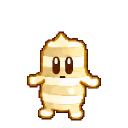
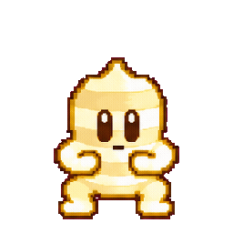
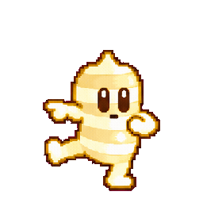
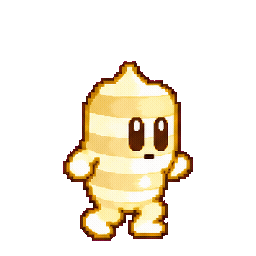
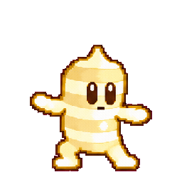

# しょうがちゃんの汎用アニメ

すべて2秒ループ、12fps、24コマ、1コマ256×256です。PNGは6列×4行で左上から右へ並び、背景にアルファ透明度があります。GIFも透過ですが、半透明はGIFの仕様で二値化されます。合成にはPNGの方がきれいです。

| ID | 動き | 主な使いどころ |
|---|---|---|
| idle | 呼吸するような待機 | 相手の説明を聞く |
| wave | 手振り | 冒頭・最後の挨拶 |
| nod | うなずき | 理解・同意 |
| think | 考える | 問いかけ・考える時間 |
| point | 指さし | 図や数字を説明する |
| cheer | 跳ねて喜ぶ | 正解・達成 |
| walk | その場歩き | 横移動と組み合わせて登場・退場 |
| surprise | 驚いて跳ねる | 意外な結果・新しい発見 |

   

   

## 教材JSONから

sceneへ `"action": "think"` などを追加します。省略時は発話に応じて指さしと待機を使います。

## JavaScriptから

```js
const fs = require('node:fs');
const { createCharacterAnimation } = require('./src/movie.cjs');
(async () => {
  const anim = await createCharacterAnimation({ action: 'wave', size: 512 });
  anim.frame(0.5); // 秒。返されるCanvasは背景透過。
  fs.writeFileSync('output/shoga.png', anim.canvas.toBuffer('image/png'));
})();
```

動画の各フレームで `frame(t)` を呼び、自分のCanvasに `drawImage()` で重ねられます。`walk` は位置を動かさないので、呼び出し側でX座標を変えます。

## ブラウザー・編集ソフトから

GIFは対応するスライドや編集ソフトにそのまま挿入できます。スプライトシートをブラウザーで使う最小例:

```html
<div class="shoga"></div>
<style>
.shoga { width:256px; height:256px; background:url(assets/animations/wave.png); }
</style>
<script>
const el = document.querySelector('.shoga');
function frame(ms) {
  const i = Math.floor(ms / 1000 * 12) % 24;
  el.style.backgroundPosition = `${-(i % 6) * 256}px ${-Math.floor(i / 6) * 256}px`;
  requestAnimationFrame(frame);
}
requestAnimationFrame(frame);
</script>
```

パスは置き場所に合わせて調整します。利用条件は [ASSET-LICENSE.md](../ASSET-LICENSE.md) を参照してください。

